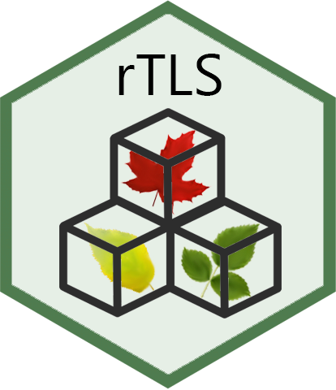

[](https://zenodo.org/badge/latestdoi/162520913)
[](https://travis-ci.com/Antguz/rTLS)

***

# rTLS 

This is an R package to that compiles a series of tools to process and calculate metrics on point clouds derived from Terrestrial Laser Scanners (TLS), also know as Terrestrial-Light Detection and Ranging (T-LiDAR).

Originally, ___rTLS___ started as a hobby by [J. Antonio Guzman Q.](https://www.jaguzmanq.com/) (<antguz06@gmail.com>) at the University of Alberta. It compiles several functions that students at the [Centre for Earth Observation Sciences](https://www.ualberta.ca/centre-for-earth-observation-sciences/index.html) use to process their point cloud of vegetation. Due to its constant use, it was decided to formalize its routines as an R package. This was done under the supervision of [Dr. Arturo Sanchez](https://www.ualberta.ca/science/about-us/contact-us/faculty-directory/arturo-sanchez-azofeifa) (<arturo.sanchez@ualberta.ca>) and the supreme help of [Ronny Hernandez](http://ronnyhdez.rbind.io/) (<ronny.hernandezm@gmail.com>). 

___rTLS___ goal is to provide a single environment to process point clouds as fast as it can be done. That it is why the ___rTLS___ coding has been evolving using different packages. The current code has been enhanced using C++ language through `Rcpp` and `RcppArmadillo` packages, and most of the time-consuming processed can be run using for parallel computing through `OpenMP`. In the future, if there is a faster way to run our main routines, we will probably change our code!

The current development of ___rTLS___ is focused on five major processes applied on TLS scans: i) voxelization, ii) point neighborhood features, iii) filtering, and iv) optimal voxel and entropy, and iv) estimation of the forest structure. Likewise, the package also contains other functions that can be used to mange point clouds such as 2D- 3D-rotation, conversion to cardinal-polar coordinates, and functions to estimate tree metrics such as truck volume or crown area.

***

### Major features include:

* Support for major platforms: Windows, Linux, macOS.

* Fast computation using parallel processing options.

* Fast voxelization using grid base methods.

* Applications of voxel-counting methods.

* Estimation of dimensionality of the neighboring points using two approach: 
    + sphere neighborhood. 
    + k-nearest neighbors.

* Calculation of basic metrics on neighboring points.

* Estimation of dimensionality.

* Estimation of the optimal voxel and sphere size using information theory (coming soon).

***

### Installation

You can install the ___rTLS___ using the CRAN platform following (pending)

```{r}
install.packages("rTLS")
```

or using the development version in github following (recommended)

```{r}
#install.packages("devtools")
devtools::install_github("Antguz/rTLS")
```
***

### Usage

Take a look to the [vignettes](https://antguz.github.io/rTLS/articles/) were we provide detaits for the use and potential applications of our functions.


